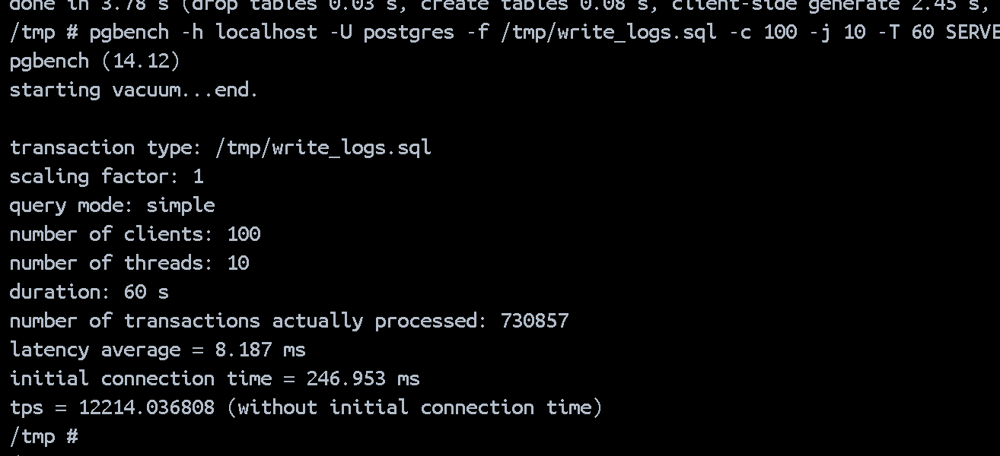

`pgbench`의 부하 테스트 결과를 아래와 같이 해석할 수 있다.

### **출력 결과**

### **결과 해석**

1. **`transaction type: /tmp/write_logs.sql`**:

    - 사용된 SQL 스크립트 파일의 경로입니다. 이 스크립트는 부하 테스트 동안 실행된 트랜잭션의 유형을 정의합니다.

2. **`scaling factor: 1`**:

    - 스케일 팩터를 `1`로 설정했습니다. 이는 `pgbench`의 기본 초기화 작업에서 설정된 데이터의 양을 나타냅니다. 스케일 팩터가 크면 데이터 양이 증가합니다.

3. **`query mode: simple`**:

    - 쿼리 모드가 `simple`로 설정되었습니다. 이 모드는 단순 쿼리 모드를 사용하여 쿼리를 실행합니다.

4. **`number of clients: 100`**:

    - 100개의 동시 클라이언트를 사용하여 테스트를 수행했습니다. 이는 동시에 데이터베이스에 연결하여 트랜잭션을 실행하는 클라이언트의 수를 나타냅니다.

5. **`number of threads: 10`**:

    - 10개의 작업 스레드를 사용하여 테스트를 수행했습니다. 이는 트랜잭션을 처리하는 데 사용되는 스레드 수를 나타냅니다.

6. **`duration: 60 s`**:

    - 테스트가 60초 동안 실행되었습니다.

7. **`number of transactions actually processed: 730857`**:

    - 테스트 동안 실제로 처리된 트랜잭션의 총 수입니다. 이 경우 730,857개의 트랜잭션이 처리되었습니다.

8. **`latency average = 8.187 ms`**:

    - 각 트랜잭션의 평균 지연 시간입니다. 이 경우 평균 지연 시간이 8.187 밀리초입니다. 낮은 지연 시간은 데이터베이스의 빠른 응답성을 의미합니다.

9. **`initial connection time = 246.953 ms`**:

    - 클라이언트가 데이터베이스와 연결을 설정하는 데 소요된 초기 시간입니다. 이 경우 246.953 밀리초입니다. 연결 설정 시간이 길어지면 데이터베이스 연결이 느려질 수 있습니다.

10. **`tps = 12214.036808 (without initial connection time)`**:
    - `initial connection time`을 제외한 초당 처리된 트랜잭션 수입니다. 이 경우, 연결 설정 시간을 제외하고 초당 12,214.04개의 트랜잭션을 처리했습니다. 이는 부하 테스트 중 데이터베이스의 실제 트랜잭션 처리 성능을 나타냅니다.

### **결론**

-   **성능**: 평균 초당 12,214개의 트랜잭션을 처리하는 것은 매우 높은 성능을 나타냅니다. 지연 시간이 평균 8.187 밀리초로 낮아, 응답 시간이 빠르다는 것을 의미합니다.
-   **초기 연결 시간**: 초기 연결 시간이 246.953 밀리초로 다소 긴 편입니다. 이는 클라이언트와 서버 간의 연결 설정 시간이 상대적으로 길다는 것을 의미합니다. 이 부분을 개선하려면 연결 풀링이나 클라이언트/서버 설정을 조정할 수 있습니다.
-   **테스트 설정**: 100개의 클라이언트와 10개의 스레드를 사용하여 테스트를 수행했습니다. 이는 높은 동시성 부하를 시뮬레이션하고, 데이터베이스가 많은 트랜잭션을 동시에 처리할 수 있는 능력을 측정합니다.

이 정보를 바탕으로 데이터베이스 성능을 평가하고, 필요한 성능 개선 조치를 계획할 수 있습니다.
