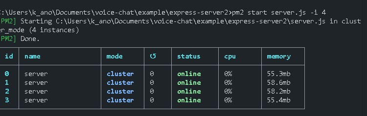
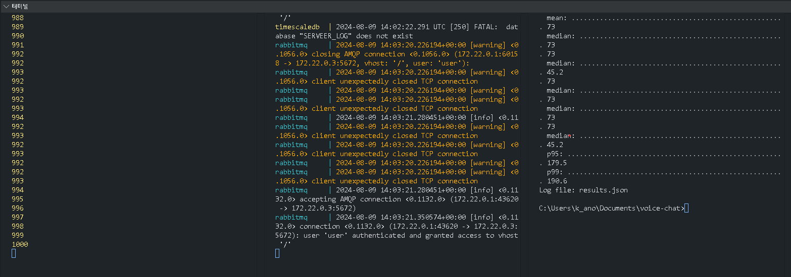
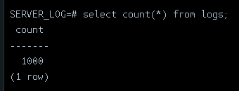

## example server cluster 4개로 `초당 1000개` 안정성 있게 받음

> 실제 서버로 옮겨서 부하 테스를 할 필요가 있음.
> `./load_test` 로 테스트 가능함.
> 현재 메모리와 cpu 사용량이 개인 컴퓨터에서 못 따라감.

DB 내에서도 이를 잘 수용하는 모습을 볼 수 있음. 초과한 경우에는 아예 example-server 부터 요청량을 받지못함. 클러스터의 요청량을 하나의 로그 서버가 감당하는 것부터 일단 성공적임

## 서버 스펙 참조

`CPU - 13th Gen Intel(R) Core(TM) i5-1340P`

`Memory - 15.6GB`

`oS - windows 11`
