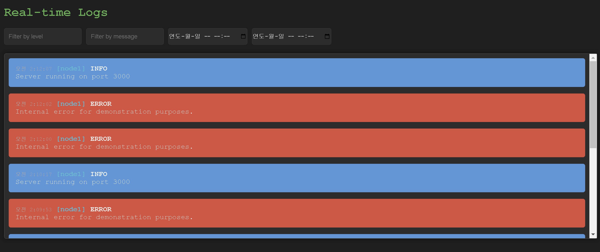
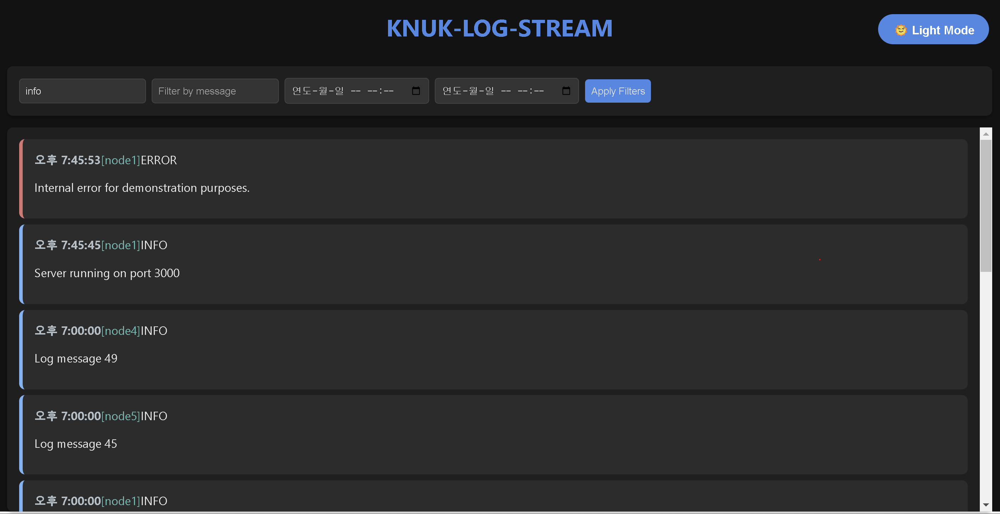
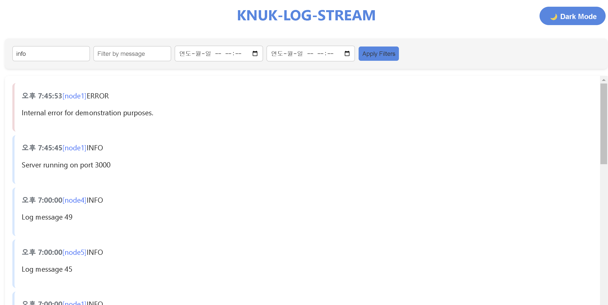

## 들어가기에 앞서

나는 Node를 통해서 개발하는 것을 좋아하는 신입 개발자이다. 해당 부분은 실제로 개발을 하면서, 로그에 대한 부분을 보고 관리하는 tool들이 너무 `많은 초기 Resource 를 차지`하고, `가파른 러닝 커브`또한 존재한다. 나는 이러한 점에서 좀 더 `단순하고 명확함이 나타나는 유틸도구`를 원했고, 이에 대해서 개발할 예정이다.

## 서론

원격의 `MSA`기반의 원격으로 분산 관리되는 프로젝트에서 로그에 대한 부분을 관리하는 것은 매우 어려운 일이다. 복잡한 라이브러리에 의존해서 로그에 대한 부분을 만들어가게 된다.

해당 프로젝트는 이런 문제를 보완하기 위해서 `gRPC`통신 기반으로 중앙 로그 관리 서버를 만들어준다. 이는 `winston` 과 같은 `level`기반 로그 라이브러리와도 궁합이 좋다. transport 되는 부분에 gRPC 요청 파트만 넣어주면 완벽하게 로그에 대한 부분을 수집할 수 있다. 같은 요청 대비 빠른 속도 가능하기 때문에 이는 굉장히 효율적이다.

해당 프로젝트를 사용하기 위한 프로젝트에 대한 기본 구성까지 포함할 예정이다.

기본적으로 실시간으로 로그 메트릭을 확인 할 수 있는 `UI Dashboard`를 지원하며, 기본적인 `filter 기능`을 통해서 이를 케어할 수 있다.

목표는 3개의 MSA 서버에서 동시에 약 5초동안 `초당 10만개`의 로그 트래픽이 생겼을 때, 어플리케이션단에서 이를 견디는 것을 목적으로 하며, 해당 메트릭을 얼마나 `실시간`으로 지원해주는지를 확인하고자 한다.

## 차별성

큰 설정 셋업 없이, 해당 프로젝트를 바로 사용하여 수집을 할 수 있게 된다. 개발의 속도가 중요한 부분에서 용이하게 쓰일 수 있도록 하는 것을 목적으로 한다.

## 폴더 구조

```
📦src
 ┣ 📂amqp
 ┃ ┣ 📜consumer.js
 ┃ ┗ 📜index.js
 ┣ 📂api
 ┃ ┣ 📂historical-logs
 ┃ ┃ ┣ 📜controller.js
 ┃ ┃ ┗ 📜index.js
 ┃ ┣ 📂logs
 ┃ ┃ ┣ 📜controller.js
 ┃ ┃ ┗ 📜index.js
 ┃ ┗ 📜inedx.js
 ┣ 📂dashboard -- react 에서 build된 파일
 ┃ ┣ 📂static
 ┃ ┃ ┣ 📂css
 ┃ ┃ ┗ 📂js
 ┣ 📂grpc
 ┃ ┣ 📂proto
 ┃ ┃ ┗ 📜logger.proto
 ┃ ┣ 📂service
 ┃ ┃ ┗ 📜index.js
 ┃ ┗ 📜index.js
 ┣ 📂loaders
 ┃ ┣ 📜client-connection.js
 ┃ ┣ 📜dependency-injection.js
 ┃ ┣ 📜express.js
 ┃ ┣ 📜grpc.js
 ┃ ┣ 📜index.js
 ┃ ┣ 📜postgresql-pool.js
 ┃ ┗ 📜rabbitmq.js
 ┣ 📂logger
 ┣ 📂utils
 ┃ ┗ 📜client-connection.js
 ┣ 📜app.js
 ┗ 📜server.js

```

## 사용 기술

| 기술                                 | 용도                                                                                                                                                                                                    |
| ------------------------------------ | ------------------------------------------------------------------------------------------------------------------------------------------------------------------------------------------------------- |
| [grpc](./docs/grpc.md)               | 중앙 서버에 로그를 보내주기 위한 통신 수단                                                                                                                                                              |
| [timescaleDB](./docs/timescaleDB.md) | 영구적인 로그 데이터를 시계열의 형태로 저장하기 위해서 사용                                                                                                                                             |
| RabbitMQ                             | grpc만으로는 디비로가는 오버헤드를 줄일 수 없다. 트래픽이 몰리는 곳인 만큼 메시지큐로 이를 제어해주는 것이 중요하다. / 최근 50개에 대한 로그는 Cache를 통해서 확인 가능 => 최대 갯수도 임의로 변경 가능 |
| SSE(server sent events)              | 실시간으로 대시보드에 스트리밍 되어야한다고 생각했기 때문에 SSE 방식을 활용하여, MQ의 작업이 완료 될 때마다 스트리밍 작업 처리를 했다.                                                                  |

## 벤치마킹

-   timeScaleDB 벤치 마킹

    -   [2024-08-06](./docs/benchmark.md)

-   부하 테스트
    -   [2024-08-09](./docs/benchmark2.md)

## 유효성 검증

-   필터 기능 유효성 검증 완료 (2024.08)

## 부하 테스트

1차 부하테스트 => cluster 3개 기준 초당 1000건의 로그 수용.

-   서버 스펙

    `CPU - 13th Gen Intel(R) Core(TM) i5-1340P`

    `Memory - 15.6GB`

    `oS - windows 11`

## 대시보드

-   v1
    
-   v1-1
    -   Dark 모드
        
    -   Light 모드
        
